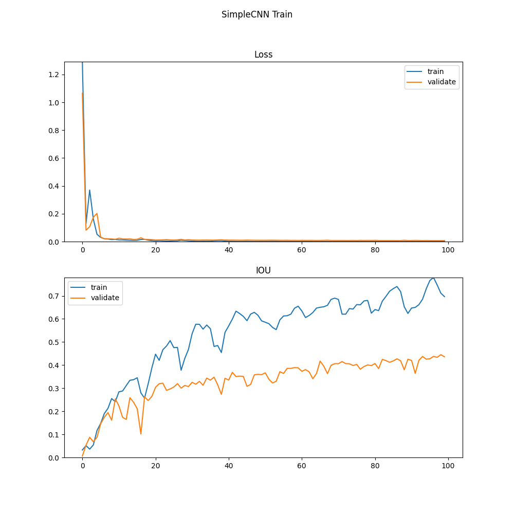
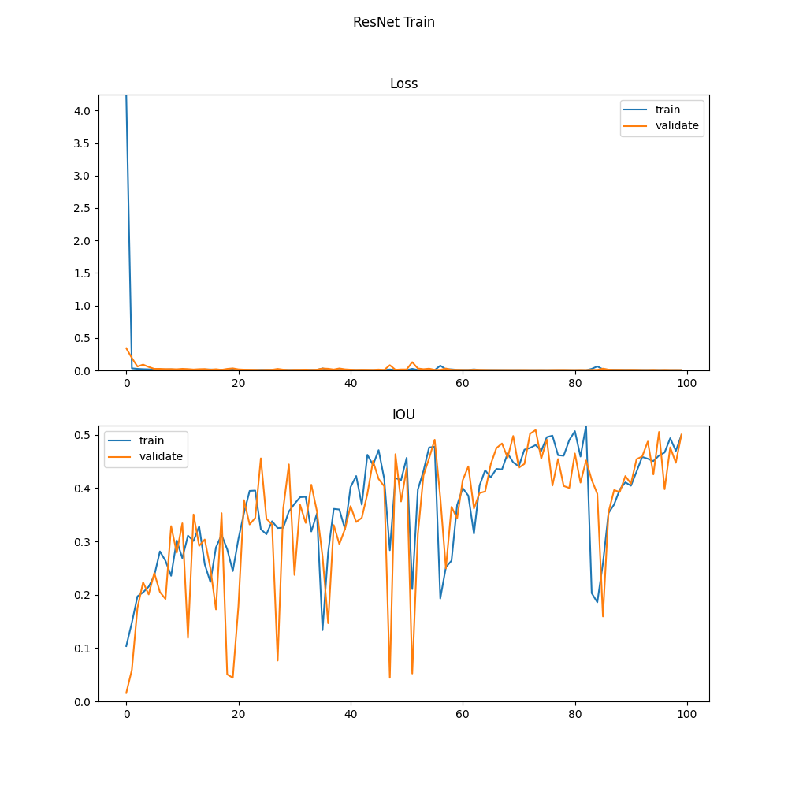

## Video Face Tracking on YTCelebrity dataset

### CSE404 project of group 12

Team member:
    Michael Stanley, Zongyuan Li, Aidan Erickson, Izaan Shaikh

### Run

    python3 main.py

Some options are provided for training

    --batch-size <default 8> --epoch <default 100> --lr <default 1e-4>

Some options for model

    --model <can be choose from simplecnn, lenet, vgg, resnet, yolo, rcnn, fastrcnn> --ckpt <load model from a checkpoint>

Some options for task

    --mode <can be choose from train: for training model, test: test on test dataset, predict: predicted on a video> --save <associated with train mode, save trained checkpoint to this path> --file <associated with predict mode, the path to video file>

### Dataset

We are using YTCelebrity dataset: http://seqamlab.com/youtube-celebrities-face-tracking-and-recognition-dataset/

Dataset contains 1910 video clips of 47 subjects at 25 fps rate. Personals face is labeled on the first frame for each video as a 4-dimensional vector: <center-x, center-y, scale, rotate-angle>.

### Evaluation

Dataset is splitted randomly as (0.6, 0.2, 0.2) with respect to training, validation and testing.

We are using IOU score to evaluate bounding boxes differences, and l1 loss for weight update.

IOU is calculated to be intersection area / union area of prediction and group truth bounding boxes. We expect IOU score to be as close to one as possible.

L1 loss is calculated by l1 distance of four elements between prediction and label. We expect l1 loss to be as lower as possible.

Test Loss: 0.02892699152289424, Test Cls Loss: 0.028453037840032874, Test Reg Loss: 0.00047395382474254194 Test IOU: 0.4726517420659495

Test Cls Loss: 0.02327281750573699, Test Reg Loss: 0.00010270591053540556 Test IOU: 0.4472824608741318

Test Loss: 0.010950345623617372, Test IOU: 0.3768567297984334 

Test Loss: 0.013357868786746016, Test IOU: 0.3368942222438499

Test Loss: 0.0047431237702160916, Test IOU: 0.6036726302901254

Test Loss: 0.005739457199524622, Test IOU: 0.46172276784602495 

Test Loss: 0.00404532278177309, Test IOU: 0.7141984857165338 

