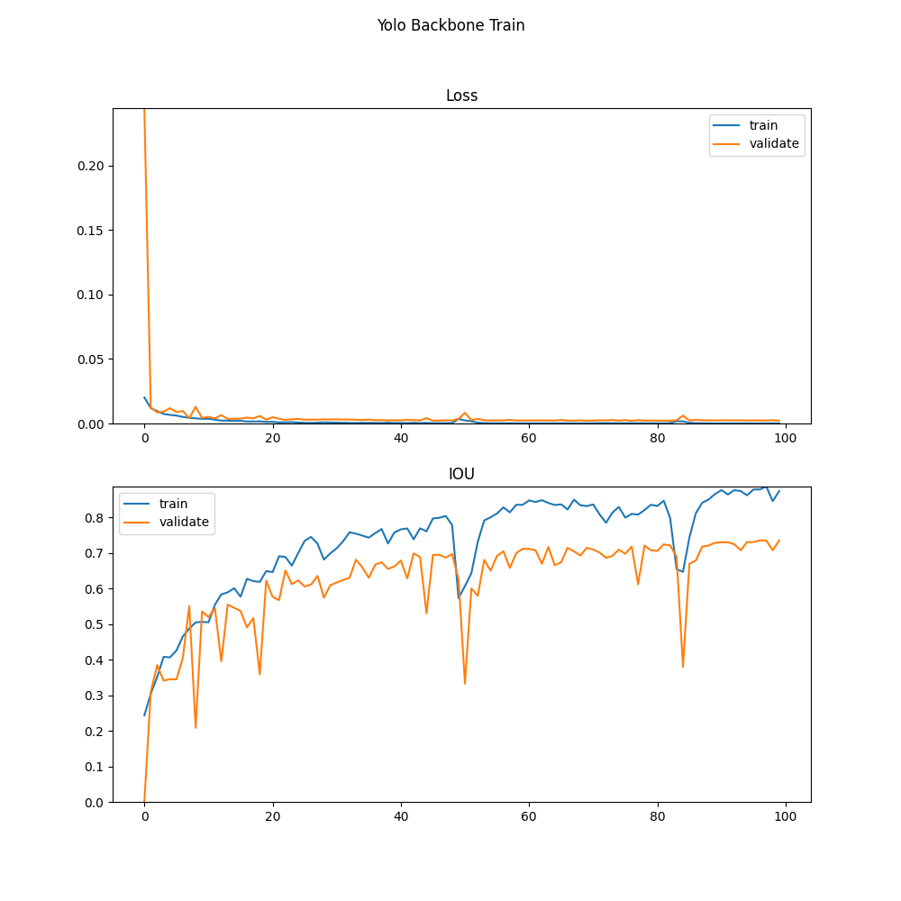
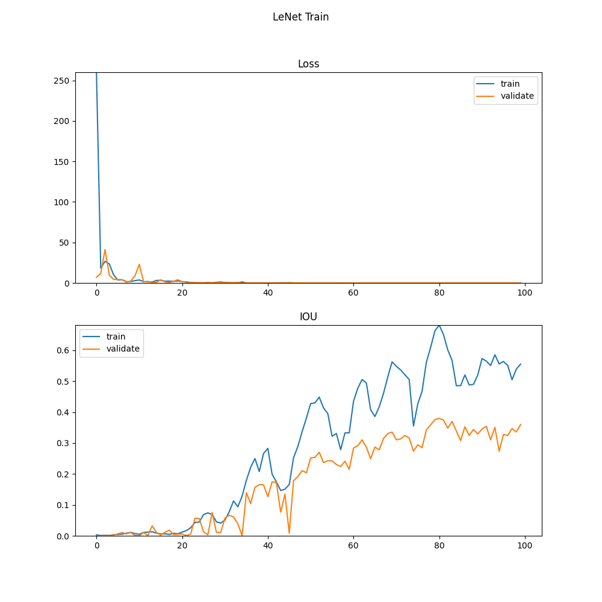

## Video Face Tracking on YTCelebrity dataset

### CSE404 project of group 12

Team member:
    Michael Stanley, Zongyuan Li, Aidan Erickson, Izaan Shaikh

### Run

    python3 main.py --root <path-to-dataset> --model simplecnn --ckpt <path-to-checkpoint> --epoch 100 --validate True

### Dataset

We are using YTCelebrity dataset: http://seqamlab.com/youtube-celebrities-face-tracking-and-recognition-dataset/

Dataset contains 1910 video clips of 47 subjects at 25 fps rate. Personals face is labeled on the first frame for each video as a 4-dimensional vector: <center-x, center-y, scale, rotate-angle>.

### Evaluation

Dataset is splitted randomly as (0.6, 0.2, 0.2) with respect to training, validation and testing.

We are using [IOU](data/process.py) score to evaluate bounding boxes differences, and l1 loss for weight update.

IOU is calculated to be intersection area / union area of prediction and group truth bounding boxes. We expect IOU score to be as close to one as possible.

L1 loss is calculated by l1 distance of four elements between prediction and label. We expect l1 loss to be as lower as possible.

Test IOU: 0.03165 Loss: 28.78139

Test IOU: 0.13269 Loss: 18.61234

Test IOU: 0.09364 Loss: 19.20259

Test IOU: 0.15020 loss: 8.76502

Test IOU: 0.13438 loss: 9.90049

### [Structure](structure.txt)

